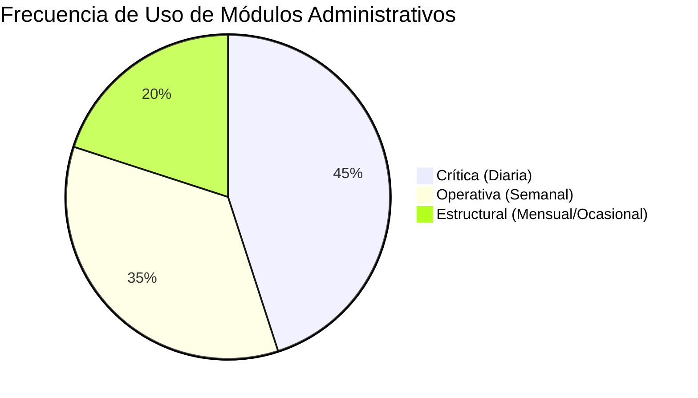
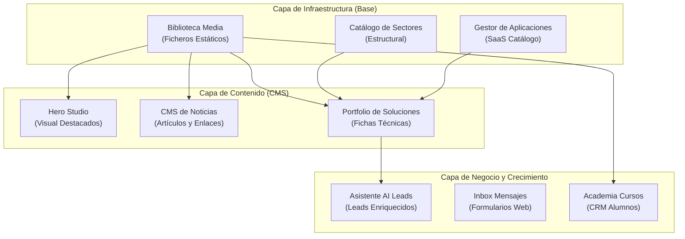

# PROJECT GUARDIAN PRE-FLIGHT CHECK INITIATED
# ARQUITECTURA ESTRATÉGICA DE NAVEGACIÓN Y EXPERIENCIA DE USUARIO (UX)
## CONTROL CENTER OS V1 — ENTORNO ADMINISTRATIVO DE PARTNERS IA

Este documento de arquitectura estratégica define los cimientos estructurales para el rediseño integral de la consola interna de **Partners IA**. El objetivo es consolidar un sistema operativo de administración unificado ("Control Center OS"), eliminando la fragmentación de menús y estructurando los flujos de trabajo sobre un modelo de datos robusto y adaptable.

---

## 1. Inventario Completo de Módulos Administrativos

El ecosistema actual de **Partners IA** está compuesto por 20 submódulos. A continuación, se presenta la correspondencia exacta de cada módulo con las entidades del modelo de datos de Prisma y su función operativa:

| Módulo Funcional | Ruta Técnica | Entidad Prisma Asociada | Propósito Operativo | Tipo de Interacción |
| :--- | :--- | :--- | :--- | :--- |
| **Control Console** | `/admin/dashboard` | `AdminConfig` | Gestión del orden de widgets analíticos y telemetría de sistemas. | Drag & Drop / Guardado dinámico. |
| **Asistente AI** | `/admin/asistente` | `AssistantLead` | Monitorización de interacciones del bot de IA, análisis de sentimiento y captación de leads. | Control de estado / Gestión de CRM. |
| **Bandeja Leads** | `/admin/leads` | `ContactLead` | Inbox de mensajes tradicionales procedentes de los formularios del sitio web. | Lectura / Clasificación / Exportación. |
| **Hero Studio** | `/admin/editorial` | `HeroMedia` | Gestor del contenido visual, textos y botones del banner principal público. | Edición visual rápida. |
| **Noticias / Blog** | `/admin/noticias` | `News` / `Category` | CMS completo de publicaciones de actualidad, posicionamiento SEO y enlaces. | Creación densa con Editor de Texto Enriquecido. |
| **Sectores** | `/admin/sectors` | `Sector` | Definición de los verticales de mercado de la organización (e.g. Logística, Retail). | CRUD / Vinculación a soluciones. |
| **Soluciones** | `/admin/soluciones` | `Solution` | Catálogo de herramientas y servicios de IA que se comercializan en la web. | CRUD complejo con relaciones múltiples. |
| **Aplicaciones** | `/admin/apps` | `App` | Gestión de micro-SaaS y software del catálogo. | CRUD / Vinculación a soluciones. |
| **Clientes** | `/admin/clientes` | `Client` | Gestión de marcas, logotipos y referencias comerciales del carrusel de inicio. | Carga de archivos y gestión de visibilidad. |
| **Partners** | `/admin/partners` | `Partner` | Directorio de alianzas tecnológicas globales de primer nivel. | CRUD / Control de relevancia. |
| **Convenios** | `/admin/convenios` | `Agreement` | Gestión de acuerdos oficiales y convenios con entidades del ecosistema. | CRUD / Registro documental. |
| **Academia / Escuela** | `/admin/escuela` | `Course` / `Enrollment` | CMS de cursos de formación, registros a webinars y alumnos. | CRUD / Seguimiento de suscripciones. |
| **Audiencia** | `/admin/newsletter` | `Subscriber` | Base de datos de correos electrónicos y suscriptores de la newsletter. | Gestión de bajas / Búsqueda activa. |
| **Campañas** | `/admin/newsletter/campaigns` | `Campaign` | Diseñador e historial de envíos de boletines por correo electrónico. | Programación de envíos / Estadísticas. |
| **SMTP Config** | `/admin/newsletter/settings` | `SmtpSetting` | Configuración del servidor de salida de correo e identidad del emisor. | Formulario técnico de credenciales SMTP. |
| **Biblioteca Media** | `/admin/media` | `Media` | Repositorio unificado de imágenes, vídeos y documentos estáticos. | Subida múltiple Drag & Drop / URLs directas. |
| **Gestión Equipo** | `/admin/equipo` | `TeamMember` | Organigrama visual de miembros de la empresa, biografías y roles públicos. | CRUD / Ordenación. |
| **Casos de Éxito** | `/admin/casos` | `UseCase` | Casos de estudio prácticos detallando retos, soluciones e impacto de la IA. | CRUD de alta densidad de texto. |
| **Navegación** | `/admin/navegacion` | `NavigationLink` | Reordenación visual del menú del header y footer público. | Drag & Drop / Reordenación lineal. |

---

## 2. Mapa de Navegación Completo (Jerarquía Actual)

Actualmente, el sistema de navegación opera en una estructura totalmente plana de 20 enlaces expuestos en el sidebar. Esto abruma visualmente al administrador. La jerarquía física de rutas en el código es la siguiente:

```
/admin
 ├── login (Acceso independiente)
 └── (dashboard) [AdminLayoutShell]
      ├── dashboard (Consola de control analítica)
      ├── asistente (CRM Leads AI)
      ├── leads (Inbox de contactos web)
      ├── editorial (Hero Studio CMS)
      ├── noticias (CMS de Publicaciones)
      ├── sectors (Catálogo de Sectores)
      ├── soluciones (Catálogo de Soluciones)
      ├── apps (Catálogo de Aplicaciones)
      ├── clientes (Logos Carrusel Clientes)
      ├── partners (Alianzas de Partners)
      ├── convenios (Administrador de Convenios)
      ├── escuela (CMS de Cursos y Academia)
      ├── newsletter (Lista de Suscriptores)
      │    ├── campaigns (Envío de Boletines)
      │    └── settings (Configuración SMTP)
      ├── media (Biblioteca de Archivos Estáticos)
      ├── equipo (Organigrama de la Organización)
      ├── casos (Casos de Éxito)
      └── navegacion (Estructura de Menús Públicos)
```

---

## 3. Frecuencia Estimada de Uso por Módulo

Para estructurar la arquitectura del "Control Center OS", analizamos con qué frecuencia interactúa el administrador con cada sección en la operativa real del negocio de **Partners IA**:



### Clase A: Crítica / Diaria (Frecuencia Alta)
*   **Módulos**: `/admin/dashboard`, `/admin/asistente`, `/admin/leads`, `/admin/noticias`.
*   **Motivo**: Son el corazón del flujo entrante de negocio. El administrador requiere monitorizar leads cualificados por la IA, responder mensajes de clientes potenciales de inmediato y publicar/editar noticias de actualidad para el posicionamiento SEO.

### Clase B: Operativa / Semanal (Frecuencia Media)
*   **Módulos**: `/admin/editorial`, `/admin/soluciones`, `/admin/escuela`, `/admin/media`, `/admin/newsletter/campaigns`.
*   **Motivo**: Gestión y mantenimiento de la oferta comercial. Edición de destacados en la Home (Hero Studio), actualización de características en soluciones del catálogo, programación de boletines semanales a la base de suscriptores e inserción de nuevos recursos en la biblioteca.

### Clase C: Estructural / Ocasional (Frecuencia Baja)
*   **Módulos**: `/admin/sectors`, `/admin/apps`, `/admin/clientes`, `/admin/partners`, `/admin/convenios`, `/admin/equipo`, `/admin/casos`, `/admin/navegacion`, `/admin/newsletter/settings`.
*   **Motivo**: Parámetros estáticos de configuración de la marca o infraestructura tecnológica. Un partner nuevo o un cambio en el menú de navegación del sitio son eventos aislados que ocurren rara vez al mes.

---

## 4. Flujo de Usuario para Tareas Críticas

Diseñamos los flujos lógicos ideales de interacción para resolver acciones críticas sin fricción:

### Tarea 1: Publicación de Noticia Optimizada para SEO
```mermaid
flowchart TD
    A[Inicio: Click en "Nueva Noticia"] --> B[Editor Enriquecido: Título, Cuerpo y Categoría]
    B --> C[Sección SEO: Autogenerar Meta-tags / URL Friendly]
    C --> D[Biblioteca Media: Seleccionar / Subir Imagen Destacada]
    D --> E{¿Vista Previa?}
    E -- Sí --> F[Simular Renderizado en Sitio Público]
    E -- No --> G[Publicar en Servidor de Producción]
    F --> G
```

### Tarea 2: Clasificación de Leads Generados por Asistente AI
```mermaid
flowchart TD
    A[Alerta: Nuevo Lead de Prioridad Alta] --> B[Entrar a Módulo /admin/asistente]
    B --> C[Revisar Insights y Sentimiento del Chat]
    C --> D[Analizar Resumen de la Conversación]
    D --> E{¿Es de Alto Valor?}
    E -- Sí --> F[Cambiar Estado a "Seguimiento" + Enviar Correo de Propuesta]
    E -- No --> G[Cambiar Estado a "Cerrado / Guardado"]
```

---

## 5. Mapa de Dependencias Visuales y de Datos

Los módulos administrativos no son entes aislados; interactúan estrechamente en el modelo relacional del sistema. Esta jerarquía de datos e interfaz guía el rediseño para no romper referencias cruzadas:



---

## 6. Propuesta de Nueva Arquitectura Administrativa (Control Center OS)

Para resolver la dispersión visual del panel de **Partners IA**, proponemos **agrupar los 20 módulos en 5 dominios conceptuales unificados**, accesibles a través de un sidebar dinámico categorizado:

### 1. Dominio: Command Center (Operaciones en Tiempo Real)
*   **Rutas unificadas**: `/admin/dashboard`, `/admin/asistente`, `/admin/leads`.
*   **Propósito**: Monitorear métricas, responder chats procesados por el motor de IA y clasificar contactos.

### 2. Dominio: CMS & Editorial (Estudio de Contenido)
*   **Rutas unificadas**: `/admin/editorial`, `/admin/noticias`, `/admin/media`.
*   **Propósito**: Diseñar el Hero principal de la Home, escribir artículos y administrar el almacenamiento estático de ficheros.

### 3. Dominio: Core Portfolio (Catálogo Comercial)
*   **Rutas unificadas**: `/admin/soluciones`, `/admin/apps`, `/admin/sectors`, `/admin/clientes`, `/admin/partners`, `/admin/convenios`.
*   **Propósito**: Mantenimiento de la propuesta de servicios al cliente (Sectores, Soluciones de IA, alianzas de Partners, logos y convenios).

### 4. Dominio: Growth & Training (Comunicaciones y Academia)
*   **Rutas unificadas**: `/admin/newsletter` (Campaigns & Settings), `/admin/escuela`, `/admin/casos`.
*   **Propósito**: Creación de marca mediante el CMS de Casos de Éxito, gestión de cursos y despachador de campañas de marketing masivo.

### 5. Dominio: System Config (Parámetros del Sistema)
*   **Rutas unificadas**: `/admin/navegacion`, `/admin/equipo`, Ajustes Generales.
*   **Propósito**: Organización del menú de la web pública, listado de equipo y llaves de mantenimiento.

---

## 7. Wireframe Conceptual del Nuevo "Control Center OS"

El Control Center OS reduce el ruido visual adoptando un layout estructurado de tres columnas responsivas para ordenadores de sobremesa y colapso inteligente de tarjetas para móviles:

```
+---------------------------------------------------------------------------------------------------------+
| PARTNERS IA  | [Búsqueda Global ⌘K ]                              (AI System: Online)  [Mi Cuenta]      |  <- Top bar
+--------------+------------------------------------------------------------------------------------------+
| COMMAND      |  INICIO > PANEL DE CONTROL                                                               |  <- Breadcrumbs
|  Dashboard   |                                                                                          |
|  AI Leads    |  [!] Panel en Modo Mantenimiento Activo                             [ Desactivar ]       |  <- Banner Alerta
|  Inbox       |                                                                                          |
|              |  +-----------------------------------+  +---------------------------------------------+  |
| PORTFOLIO    |  | METRICAS CLAVE                    |  | RENDIMIENTO DE LEADS                        |  |
|  Soluciones  |  | [ Leads: 45 ]  [ Soluciones: 12 ] |  | (Gráfico SVG Limpio)                        |  |  <- Dashboard Grid
|  Sectores    |  +-----------------------------------+  +---------------------------------------------+  |
|              |                                                                                          |
| CMS STUDIO   |  +------------------------------------------------------------------------------------+  |
|  Noticias    |  | ULTIMAS INTERACCIONES ASISTENTE AI                                                 |  |
|  Biblioteca  |  | Nombre     Sentiment     Prioridad     Estado          Acciones                        |  |  <- AdminTable
|              |  | Juan P.    [Heart] Pos.  [Zap] TOP     (Seguimiento)   [ ⋯ ] < ActionMenu              |  |
| CONFIG       |  | Maria G.   [Spark] Neu.  [ ] Med.      (Nuevo)         [ ⋯ ]                           |  |
|  Navegación  |  +------------------------------------------------------------------------------------+  |
+--------------+------------------------------------------------------------------------------------------+
```

---

## 8. Dashboard Ideal del Administrador

El área de `/admin/dashboard` debe configurarse como un centro analítico ejecutivo con widgets integrados que sirva para la toma de decisiones rápidas de negocio:

1.  **Fila de Tarjetas de Telemetría Rápida (KPIs)**:
    *   *Widget 1 (Leads de IA)*: Tarjeta interactiva mostrando el conteo de leads captados por el asistente con su tasa de conversión semanal (`+15%` de tendencia).
    *   *Widget 2 (Salud del Sistema)*: Estado de sincronización en tiempo real del RAG de base de datos Neon y servidor de correo Hostinger.
    *   *Widget 3 (Campañas)*: Ratio de apertura y clics del último envío masivo del newsletter.
2.  **Mapeo Gráfico SVG Dinámico**:
    *   Línea de tendencia de leads semanales, dibujada con trazo de vector SVG de carga ultraligera sin depender de librerías externas de gran peso.
3.  **Módulo AI Assistant Quick Insights**:
    *   Una pequeña burbuja de control inteligente que resume con lenguaje natural el rendimiento global: *"El asistente captó 8 leads calificados esta semana con sentimiento positivo elevado. El sector Retail lidera el interés comercial."*

---

## 9. Sidebar Ideal (Premium, Colapsable y Categorizado)

El Sidebar ideal se rediseñará para maximizar el espacio útil en pantalla y ofrecer una navegación intuitiva que no sature la vista:

*   **Agrupamiento por Dominios**: Los enlaces planos actuales se consolidan bajo encabezados de sección en mayúscula con baja opacidad (`text-gray-400 font-bold uppercase text-[10px] tracking-wider mb-2`).
*   **Iconografía Consistente**: Iconos de trazado fino (`stroke-width: 1.5px`) para cada enlace de menú.
*   **Indicadores de Atajos de Teclado**: Inserción de pistas visuales discretas de atajos como `⌘D` (Dashboard), `⌘N` (Noticias), `⌘M` (Media).
*   **Botón de Colapso Lateral (Docking)**: Un pequeño tirador en el borde derecho que pliega el sidebar a modo de barra de iconos minimalistas de `w-16`, permitiendo ganar un 25% extra de anchura útil para la edición de formularios complejos en ordenadores.

---

## 10. Sistema de Navegación Ideal

El ecosistema Control Center OS implementará un sistema de navegación unificado compuesto por tres capas de interacción coordinadas:

```
+-------------------------------------------------------------------------+
| [Capa 1] Global Command Palette (⌘K) -> Buscador y Acceso Instantáneo  |
+-------------------------------------------------------------------------+
| [Capa 2] Breadcrumbs Dinámicos -> Historial de ubicación del flujo     |
+-------------------------------------------------------------------------+
| [Capa 3] Pestañas de Contexto (Tabs) -> Submódulos sin recargar página  |
+-------------------------------------------------------------------------+
```

### Capa 1: Global Command Palette (`⌘K`)
*   Un buscador superpuesto en pantalla al pulsar la combinación de teclas. Permite al administrador saltar de forma inmediata a cualquier ficha (ej. escribir *"noticia"* listará opciones de *Nueva Noticia*, *Ver Noticias*, *Buscar Categorías*), optimizando el flujo de trabajo sin requerir clics en menús.

### Capa 2: Breadcrumbs Dinámicos (Ubicación Contextual)
*   En la barra superior de `AdminLayoutShell`, un historial limpio que indica exactamente el camino recorrido en el ecosistema (ej. `Catálogo > Soluciones > Editar Solución Inteligente RAG`).

### Capa 3: Pestañas de Contexto (Tabs Internos)
*   Sustitución de páginas sueltas por layouts con pestañas horizontales. Por ejemplo, en el módulo de Newsletter, la navegación entre *Lista de Suscriptores*, *Campañas Activas* y *Servidor SMTP* se realizará dentro de la misma página mediante pestañas fluidas sin refrescar el navegador, acelerando la operatividad.
