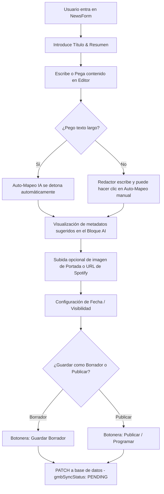

# NEWSFORM CONTROL CENTER V1 — DISEÑO DEFINITIVO

Este documento define la arquitectura visual, el diseño de experiencia de usuario (UX/UI) y las especificaciones de ingeniería para la remodelación del formulario de noticias (`NewsForm`) en **Partners IA**. 

Bajo la filosofía **Control Center OS**, abandonamos los sistemas de pestañas clásicas en favor de un espacio de trabajo asimétrico, inmersivo y altamente productivo inspirado en herramientas de referencia global como **Notion**, **Linear** y el panel de control de **Stripe**.

---

## 1. FILOSOFÍA Y DISTRIBUCIÓN DEL ESPACIO

El formulario se organiza en una proporción de **70% de espacio útil para el contenido** y **30% para metadatos y configuración**, optimizando el foco editorial del redactor sin sacrificar el control operacional.

### 1.1 Zona Principal (70%): Área de Enfoque Editorial
Diseñada para simular un editor de blog premium libre de distracciones.
*   **Título Inmersivo**: Entrada de texto de gran formato (`text-2xl` a `text-3xl`), sin bordes visibles por defecto (estilo Notion/Medium), tipografía Outfit Bold. Se enfoca al entrar a la página.
*   **Resumen / Copete**: Campo secundario integrado fluidamente debajo del título. 
    *   *Garantía de Base de Datos*: Dado que el modelo `NewsPost` no incluye una columna `summary` o `resumen` en Prisma y no podemos alterar la base de datos, este campo **se mapea de forma inteligente como el párrafo inicial** (envoltorio `<p class="lead-paragraph">...</p>`) dentro del campo `content` al guardar en base de datos. Esto asegura compatibilidad 100% sin migraciones.
*   **Editor Híbrido**: Cabecera ultra-limpia con selector discreto para alternar entre:
    *   *Visual*: Editor Quill simplificado con tipografía Inter y un toolbar flotante que solo muestra herramientas clave.
    *   *HTML*: Textarea crudo estilo terminal oscuro con tipografía monoespaciada para desarrolladores o redactores técnicos.

### 1.2 Panel Lateral (30%): Configuración y Bloque Inteligente AI
Ubicado en la derecha en Desktop para actuar como la consola de control y telemetría de la noticia.
*   **Sección de Publicación**: Estado actual (Borrador vs Publicado) con fecha y hora programada mediante inputs táctiles limpios.
*   **Zona Multimedia**: Subida de portada integrada de forma compacta y visual.
*   **Bloque Inteligente AI Insights**: Unifica los 6 metadatos avanzados de IA (`Empresa`, `Herramienta`, `Tipo IA`, `Área`, `Sector`, `Profesión`) bajo una única tarjeta operativa coordinada. Cuenta con el detonador del **Auto-Mapeo IA** en la cabecera.

### 1.3 Sticky Action Bar (Barra Adhesiva de Bottom)
Siempre visible y flotante sobre el contenido, proporcionando consistencia móvil y de escritorio.
*   **Guardar Borrador**: Acción secundaria (Estilo claro/blanco, borde fino).
*   **Vista Previa**: Abre una previsualización modal en tiempo real.
*   **Sincronizar**: Sincronización manual con Google Business (si la noticia ya existe).
*   **Publicar / Programar**: Acción primaria premium (Fondo azul vibrante con micro-glow y letras bold).

---

## 2. WIREFRAMES CONCEPTUALES ASCII

### 2.1 Desktop View (1440px)
```
┌────────────────────────────────────────────────────────────────────────┐
│  [Command Center] > Redactar Noticia                                   │
├────────────────────────────────────────────────────────────────────────┤
│                                                                        │
│  ┌─ ZONA PRINCIPAL (70%) ────────────────┐ ┌─ PANEL LATERAL (30%) ────┐ │
│  │                                       │ │ ┌─ Publicación y Fechas ┐ │
│  │  * Título                             │ │ │ [x] Publicado Online  │ │
│  │  [ Google lanza Gemini 1.5 Pro     ]  │ │ │ [ 2026-05-29 13:20 ]  │ │
│  │                                       │ │ └───────────────────────┘ │
│  │  * Resumen (Copete / Párrafo Lead)    │ │ ┌─ Portada Multimedia ──┐ │
│  │  [ Un análisis sobre la revolución..] │ │ │ ┌───────────────────┐ │ │
│  │                                       │ │ │ │ [Subir Portada]   │ │ │
│  │  ┌─ Editor [ Visual ] [ HTML ] ─────┐ │ │ │ └───────────────────┘ │ │
│  │  │                                  │ │ └───────────────────────┘ │
│  │  │ Google DeepMind ha presentado... │ │ ┌─ Bloque Inteligente AI ─┐ │
│  │  │                                  │ │ │ [Zap] Auto-Mapeo IA   │ │
│  │  │                                  │ │ │ ───────────────────── │ │
│  │  │                                  │ │ │ * Empresa: OpenAI     │ │
│  │  └──────────────────────────────────┘ │ │ │ * Herramienta: Gemini │ │
│  └───────────────────────────────────────┘ │ │ * Tipo: IA Generativa │ │
│                                            │ │ ... [Ver todos]       │ │
│                                            │ └───────────────────────┘ │
│                                            └───────────────────────────┘ │
│                                                                        │
├────────────────────────────────────────────────────────────────────────┤
│  [ Guardar Borrador ]   [ Vista Previa ]    [ Sincronizar ]  [ PUBLICAR ]│
└────────────────────────────────────────────────────────────────────────┘
```

### 2.2 Tablet View (1024px / 768px)
El panel lateral pasa debajo de la zona principal. La distribución se adapta a una cuadrícula fluida de 1 columna para el cuerpo y 2 columnas para la configuración en tablets verticales.

```
┌────────────────────────────────────────────────────────────────────────┐
│  Redactar Noticia                                                      │
├────────────────────────────────────────────────────────────────────────┤
│  * Título de la Noticia                                                │
│  [ Google lanza Gemini 1.5 Pro                                       ] │
│                                                                        │
│  * Resumen / Párrafo Lead                                              │
│  [ Un análisis sobre la revolución de los modelos de contexto largo. ] │
│                                                                        │
│  ┌─ Cuerpo de la Noticia [ Visual ] [ HTML ] ────────────────────────┐ │
│  │ Google DeepMind ha presentado oficialmente Gemini 1.5 Pro...      │ │
│  └───────────────────────────────────────────────────────────────────┘ │
│                                                                        │
│  ┌─ Configuración de Publicación ─────┐ ┌─ Bloque Inteligente AI ─────┐ │
│  │ [x] Publicado Online               │ │ [Zap] Auto-Mapeo IA         │ │
│  │ [ 2026-05-29 13:20               ] │ │ * Empresa: OpenAI           │ │
│  │                                    │ │ * Herramienta: Gemini       │ │
│  └────────────────────────────────────┘ └─────────────────────────────┘ │
│                                                                        │
├────────────────────────────────────────────────────────────────────────┤
│  [ Guardar Borrador ]   [ Vista Previa ]    [ Sincronizar ]  [ PUBLICAR ]│
└────────────────────────────────────────────────────────────────────────┘
```

### 2.3 Mobile View (390px)
Experiencia 100% táctil, limpia, con scroll vertical natural. La barra de acciones inferior se fija a la pantalla del dispositivo.

```
┌──────────────────────────────────────┐
│  [<] Redactar Noticia                │
├──────────────────────────────────────┤
│  * Título                            │
│  [ Google lanza Gemini 1.5 Pro ]     │
│                                      │
│  * Resumen / Párrafo Lead            │
│  [ Un análisis sobre la revolu.. ]   │
│                                      │
│  ┌─ Cuerpo [ Visual ] [ HTML ] ────┐ │
│  │ Google DeepMind ha presentado.. │ │
│  └─────────────────────────────────┘ │
│                                      │
│  [x] Publicado Online                │
│  [ 2026-05-29 13:20 ]                │
│                                      │
│  ┌─ AI Insights ───────────────────┐ │
│  │ [Zap] AUTO-MAPEO IA             │ │
│  │ * Empresa: OpenAI               │ │
│  │ * Herramienta: Gemini           │ │
│  └─────────────────────────────────┘ │
├──────────────────────────────────────┤
│ [Borrador] [Vista Previa] [PUBLICAR] │
└──────────────────────────────────────┘
```

---

## 3. FLUJO EDITORIAL (PASO A PASO)



---

## 4. ANÁLISIS DE RIESGOS TÉCNICOS

### 4.1 Riesgos en React Hook Form
*   **Riesgo**: Dado que no estamos desmontando los campos con pestañas condicionales físicas sino manteniéndolos en un layout de panel asimétrico, el rendimiento al escribir en tiempo real en títulos y descripciones podría degradarse en dispositivos móviles antiguos.
*   **Mitigación**: 
    1.  Utilizar el comportamiento `mode: "onTouched"` para que la validación visual solo ocurra cuando el usuario interactúe y salga del campo.
    2.  Evitar re-renderizados globales en cascada del componente controlando el estado del editor de Quill de forma local en lugar de delegar cada pulsación de tecla (`onChange`) a un estado general del formulario.

### 4.2 Riesgos en Quill Editor (SSR & Visual HTML Sync)
*   **Riesgo 1**: Carga en servidor (SSR). React Quill utiliza selectores globales y APIs del objeto `window` (como `document.createElement`), lo que genera errores de hidratación en Next.js.
*   **Mitigación**: Mantener la importación dinámica `dynamic(() => import('react-quill-new'), { ssr: false })` y renderizar un esqueleto visual (`skeleton pulse`) para evitar saltos bruscos en el Cumulative Layout Shift (CLS).
*   **Riesgo 2**: Sincronización entre Modo Visual (Quill) y Modo HTML (Textarea). Si el usuario edita el código HTML en crudo y cambia al visual, se pueden generar etiquetas rotas u omitir caracteres de escape.
*   **Mitigación**: Implementar una función de saneamiento visual (`DOMPurify` o reemplazos nativos discretos en frontend) al transicionar de HTML a Visual, y forzar la sincronización exacta a la clave del formulario `content` usando `setValue('content', value)`.

### 4.3 Compatibilidad de Campos con la Base de Datos
*   **Riesgo**: El usuario desea introducir un "Resumen", pero el modelo `NewsPost` no soporta esa columna en Prisma y tenemos prohibido tocar la base de datos o realizar migraciones.
*   **Mitigación**: 
    *   Al enviar el formulario, el valor del input "Resumen" se concatena al principio de `content` estructurado bajo un formato especial: `<p class="lead-paragraph font-semibold text-lg text-gray-600 mb-6">...[Resumen]...</p>`.
    *   Al cargar el formulario de edición (`initialData`), se detecta si existe un párrafo con la clase `lead-paragraph` al inicio del contenido usando una expresión regular de HTML simple en React. Si existe, se extrae su texto para pre-poblar el input "Resumen" del formulario, y el resto del texto se carga en el editor.
    *   *Resultado*: Compatibilidad total con la base de datos del proyecto sin tocar una sola migración.

---

## 5. PLAN DE IMPLEMENTACIÓN INCREMENTAL

1.  **Capa CSS Base**: Definir las clases para el layout asimétrico de dos columnas (`.admin-news-editor-grid`) y del Sticky Action Bar (`.admin-sticky-bar`) en `AdminInfrastructure.css`.
2.  **Formulario Esqueleto**: Modificar la estructura JSX en `NewsForm.tsx` para sustituir los antiguos contenedores `AdminCard` planos por el diseño asimétrico 70% contenido / 30% configuración.
3.  **Extractor de Resumen**: Añadir la lógica de expresiones regulares en la carga del `NewsForm` para aislar el primer párrafo con clase `lead-paragraph` como "Resumen" visual del artículo.
4.  **Bloque Inteligente AI**: Diseñar la rejilla colapsable del panel lateral con transiciones de hover limpias.
5.  **Barra Adhesiva de Acciones**: Enlazar los botones flotantes del bottom con los estados `isSubmitting` del formulario.
6.  **Validación de Compilación**: Ejecutar `npm run build` para asegurar el cumplimiento del estándar de Next.js.

---

## 6. PROTOCOLO DE ROLLBACK (RETROCOMPATIBILIDAD)

Toda modificación de formularios se realizará en una rama específica: `feature/newsform-linear-redesign`.
En caso de anomalías críticas, el protocolo de recuperación es:

1.  **Cero Migraciones Involucradas**: Como no se alteran esquemas de Prisma ni modelos de base de datos, el rollback es inmediato a nivel de código Git.
2.  **Restauración Rápida**:
    ```bash
    git checkout master src/components/admin/NewsForm.tsx
    ```
    Esto descarta instantáneamente los refactors de rediseño y restaura la visualización original sin pérdidas de información.
